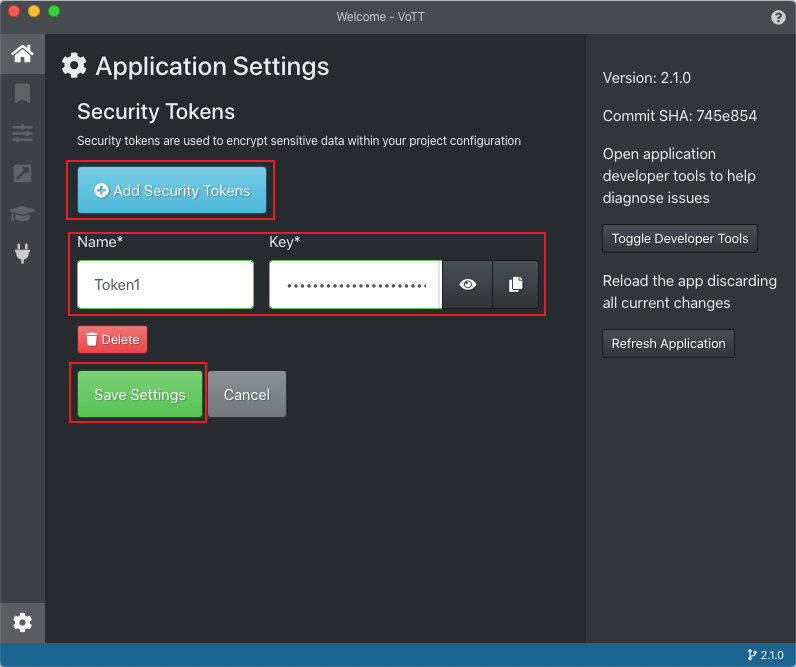
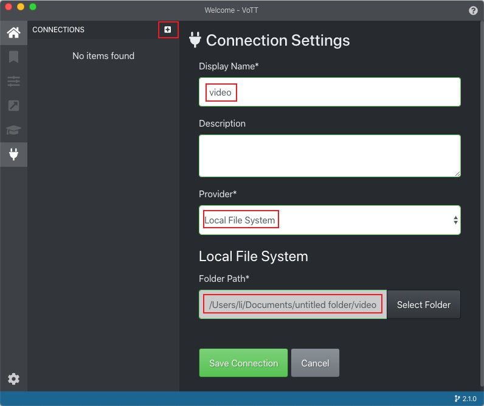
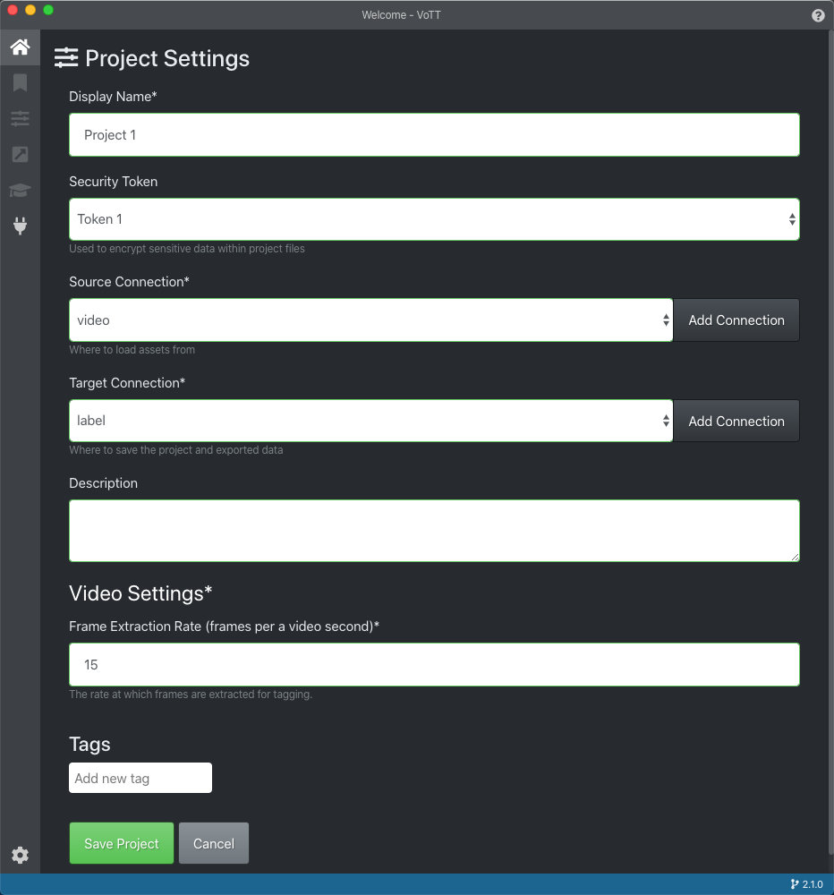
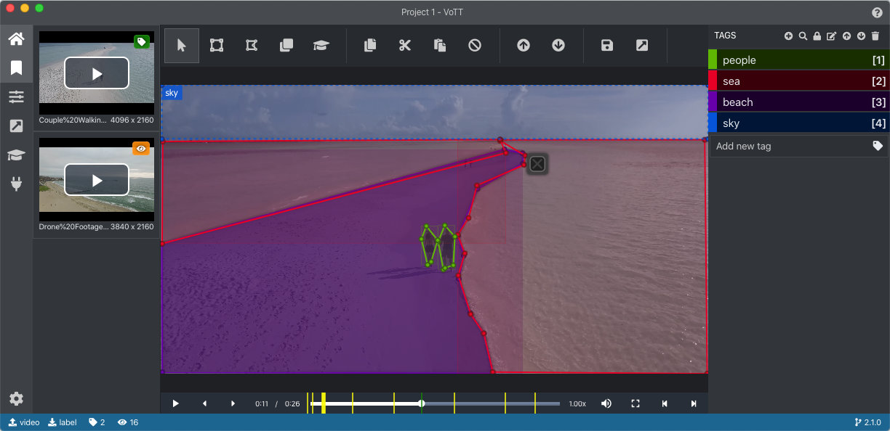
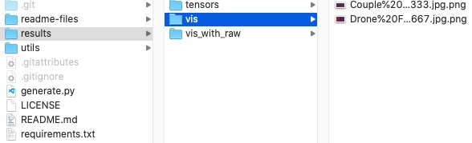
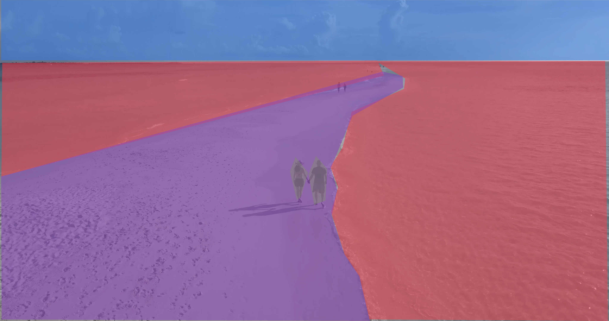
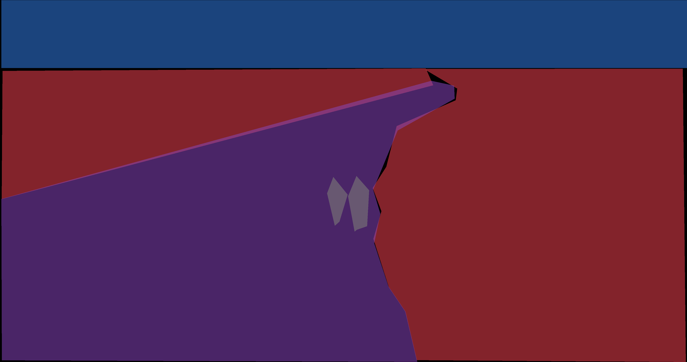

# VoTT-label-export
 Scripts and guidance to export VoTT label of video semantic segmentation
 
 [日本語](https://github.com/conscienceli/VoTT-label-export/blob/master/README_jp.md)

 VoTT is an open source annotation and labeling tool for image and video assets proposed by Micorsoft. It is hosted on https://github.com/microsoft/VoTT.

 VoTT can export labels into several formats. However, all of these formats are not so convenient for end-to-end sematic segmentation. Thus, this repo is to analyze the output labels and transform them into mask images. If you want more custom labeling formats, it is easy to modify the result generating part in "generate.py". 

### Steps to generate mask images
1. Labelling video with VoTT
2. Export from VoTT with "VoTT JSON" format.
3. Run "python generate.py -d label_directory" command to generate the mask images, which can be used in end-to-end training directly.

### 1. Guidance for Video Labelling with VoTT
#### (a) Add Security Token
* Press setting icon in the left-bottom corner.
* Add a new token which will protect your data privacy.

#### (b) Add Connection (input/output directory)
* Create two new directories, for example, "video" and "label". 
* Put raw data (videos) in the "video" directory.
* Then add two connections in VoTT.

#### (c) Create New Project
* Make a new project with the token and connections created before.

#### (d) Label the data
* All videos in the source folder would be showed in the left panel.
* All frames in videos will be one of the three categories: unvisited, visited but no labels, labelled.
* "Next/prev frame" button will pause the video and jump to the next/prev frame.
* "Next/prev tagged frame" button will pause the video and jump to the next/prev labelled frame.
* Visited frames will be marked with yellow in the progress bar, and labeled frames are in green.
* All labels can be created and selected in the tag panel.

#### (e) Export VoTT JSON
* Switch the Provider option in the export settings to "VoTT JSON".
* Select the preferred option among three asset state, i.e., all frames, only visited frames, and only labelled frames.
* Back to project and press the export button.
* Then we can get a folder named "vott-json-export" in the "label" directory, including all labelling information in the JSON file and all the screenshots of the corresponding frames.

### 2. Guidance for Using the Script

Run the following commands.
`python generate.py -i 'Project-1-export.json' -o './results/'`
`-i` is to specify the json file and `-o` to specify the output path.

The script will create three folders in the output path, i.e., "vis" storing the masks, "vis_with_raw" storing the raw frames with label masks, and "tensors" having the pickle files which can be used to load the category value for each pixel.

File structures are as follows.

Files are given the same name as the screenshots from VoTT, i.e., "video_name#timestamp.jpg"

Generated masks:
* vis_with_raw

* vis

