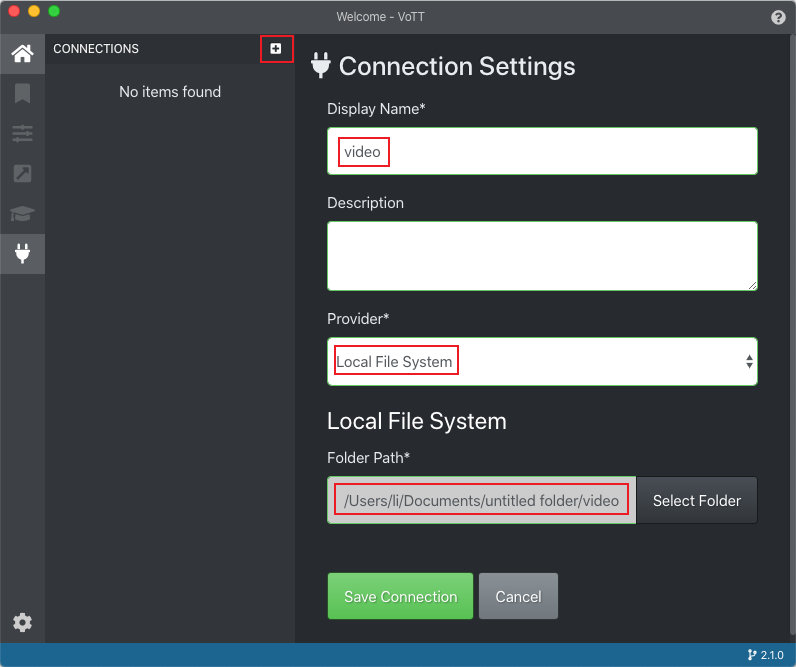
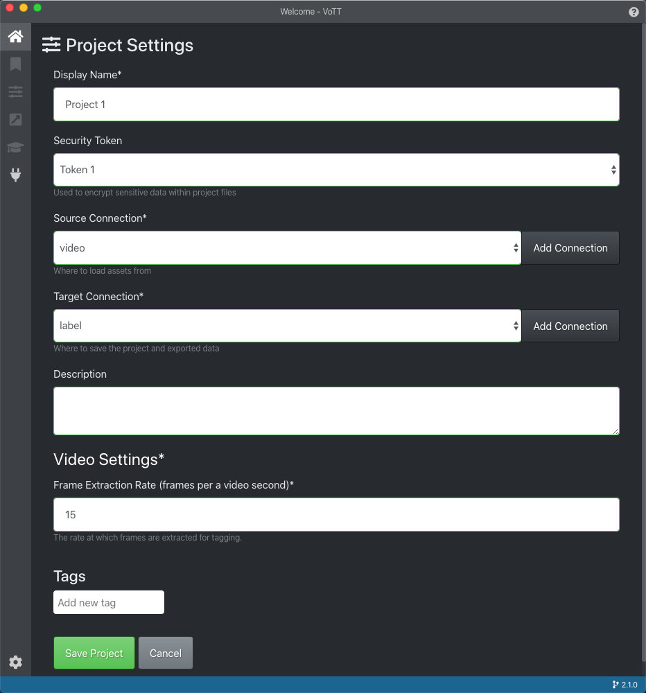
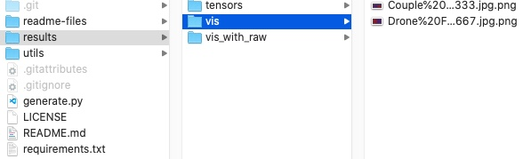
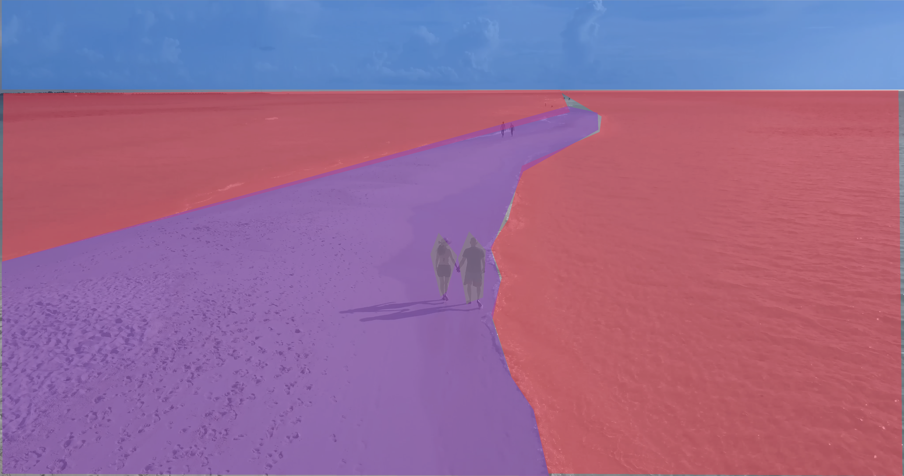

# VoTT-label-export
ビデオセマンティックセグメンテーションのVoTTラベルをエクスポートするためのスクリプトとガイダンス

[English Version](https://github.com/conscienceli/VoTT-label-export)

VoTTは、Micorsoftの画像およびビデオ用のオープンソースのラベリングツールです。 https://github.com/microsoft/VoTT

VoTTは、ラベルをいくつかの形式にエクスポートできます。 ただし、これらの形式はすべて、エンドツーエンドのセマティックセグメンテーションにそれほど便利ではありません。 したがって、このプロジェクトはVoTTの出力ラベルを分析し、それらをマスク画像に変換します。 別のラベリング形式が必要な場合は、「generate.py」の結果生成部分を変更してください。

### マスク画像を生成する手順

1. VoTTでビデオにラベルを付ける。
2. VoTT JSON形式でエクスポートします。
3. `python generate.py -d label_directory`を実行して、エンドツーエンドのトレーニングで直接使用できるマスク画像を生成します。

### 1. VoTTを使用したビデオラベリングのガイダンス
#### (a) セキュリティトークンを追加
* 左下隅の設定アイコンを押します。
* データプライバシーを保護する新しいトークンを追加します。

#### (b) 接続の追加（入力/出力フォルダー）
* 2つフォルダーを作成します（「video」と「label」）。
* 生データ（ビデオ）を「video」フォルダーに入れます。
* 次に、VoTTでこの2つのフォルダーとの接続を追加します。

#### (c) 新しいプロジェクトを作成
* 作成したトークンと接続を使用して新しいプロジェクトを作成します。

#### (d) データにラベルを付ける
* ソースフォルダー内のすべてのビデオが左パネルに表示されます。
* 動画のすべてのフレームは、未訪問、訪問したけどラベルなし、ラベル付きの3つのカテゴリのいずれかになります。
* 「次/前のフレーム」ボタンはビデオを一時停止し、次/前のフレームにジャンプします。
* 「次/前のタグ付きフレーム」ボタンは、ビデオを一時停止し、次/前のラベル付きフレームにジャンプします。
* 訪問したフレームは進行状況バーで黄色でマークされ、ラベル付きフレームは緑色で表示されます。
* すべてのラベルは、タグパネルで作成および選択できます。

#### (e) VoTT JSONをエクスポート
* エクスポート設定のプロバイダーオプションを「VoTT JSON」に切り替えます。
* すべてのフレームをエクスポートと、訪問したフレームのみをエクスポートと、ラベル付きフレームのみをエクスポートの3つのオプションから選択します。
* プロジェクトに戻り、エクスポートボタンを押します。
* 次に、「label」フォルダーに「vott-json-export」という名前のフォルダーが作成され、これには、すべてのラベル付け情報を保存したJSONファイルと、対応するすべてのフレームのスクリーンショットファイルが含まれます。

### 2. スクリプトのガイダンス

次のコマンドを実行します。
`python generate.py -i 'Project-1-export.json' -o './results/'`
`-i`はjsonファイルを指定し、`-o`は出力パスを指定します。

スクリプトは、出力パスに3つのフォルダーを作成します。それは、マスクを格納する「vis」フォルダーと、ラベルマスクを含む生フレームを格納する「vis_with_raw」フォルダーと、およびそれぞれのカテゴリ値をロードするために使用できるPickleファイルを持つ「tensors」 フォルダー。

ファイル構造は次のとおりです。

ファイルには、VoTTのスクリーンショットと同じ名前、つまり「video_name＃timestamp.jpg」が付けられます。

生成されたマスク：
* vis_with_raw

* vis

